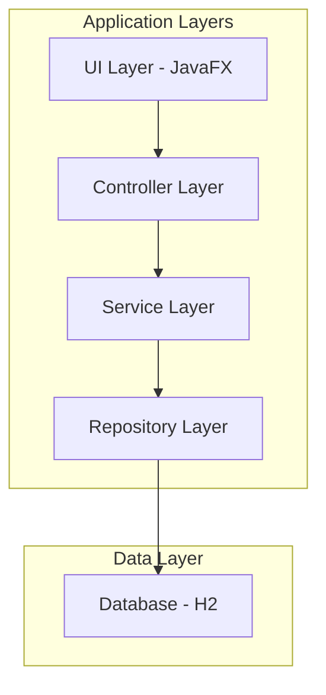

# Architecture Documentation

## Overview

NEZR2 follows a layered architecture pattern with clear separation of concerns between the UI, business logic, and data layers. The application is built using Spring Boot for dependency injection and JavaFX for the user interface.

## Architecture Diagram



## Component Architecture

### UI Layer (JavaFX)
- FXML files for view definitions
- Controllers for handling user interactions
- ScreenController for managing view navigation

### Controller Layer
- Handles user input and updates the model
- Coordinates between UI and service layers
- Key controllers include:
  - StartController
  - QuestionController
  - QuestionListController
  - SurveyController
  - ExportController

### Service Layer
- Contains business logic
- Manages data processing and validation
- Key services include:
  - QuestionService
  - QuestionListService
  - SurveyService
  - ExportService
  - CategoryService
  - HeadlineService

### Repository Layer
- Direct database access
- Uses JDBC for database operations
- Liquibase for database schema management

### Data Layer
- H2 Database for data storage
- Liquibase changelogs for schema versioning

## Design Patterns

### MVC Pattern
The application follows the Model-View-Controller pattern:
- **Model**: Data classes in the `model` package
- **View**: FXML files in `src/main/resources/view`
- **Controller**: Controller classes in respective packages

### Dependency Injection
Spring Boot is used for dependency injection to manage component lifecycle and dependencies.

### Singleton Pattern
Certain services and controllers are implemented as singletons to ensure consistent state management.

## Data Flow

1. User interacts with UI (FXML views)
2. Controller receives input and processes user actions
3. Controller calls appropriate Service methods
4. Service layer performs business logic and data operations
5. Repository layer handles database interactions
6. Results are returned back through the layers to update the UI

## Package Structure

```
de.vatrascell.nezr
├── admin
├── application
├── category
├── export
├── flag
├── gratitude
├── headline
├── location
├── login
├── message
├── model
├── multipleChoiceQuestion
├── question
├── questionList
├── react
├── relation
├── start
├── survey
└── validation
```

Each package contains related functionality with clear separation of concerns.