# Database Schema Documentation

## Overview

NEZR2 uses an H2 database for data storage with Liquibase for schema management. The database schema is designed to support questionnaire creation, management, and survey data collection.

## Database Schema Diagram

```mermaid
erDiagram
    LOCATION ||--o{ QUESTIONNAIRE : "has"
    QUESTIONNAIRE ||--o{ QUESTIONNAIRE_HAS_MULTIPLE_CHOICE : "contains"
    QUESTIONNAIRE ||--o{ QUESTIONNAIRE_HAS_SHORT_ANSWER : "contains"
    QUESTIONNAIRE ||--o{ SURVEY : "collects"
    
    CATEGORY ||--o{ MULTIPLE_CHOICE : "categorizes"
    CATEGORY ||--o{ SHORT_ANSWER : "categorizes"
    
    HEADLINE ||--o{ MULTIPLE_CHOICE : "groups"
    HEADLINE ||--o{ SHORT_ANSWER : "groups"
    
    MULTIPLE_CHOICE ||--o{ MULTIPLE_CHOICE_HAS_ANSWER_OPTION : "has"
    MULTIPLE_CHOICE ||--o{ MULTIPLE_CHOICE_HAS_REACT : "triggers"
    MULTIPLE_CHOICE ||--o{ QUESTIONNAIRE_HAS_MULTIPLE_CHOICE : "belongs_to"
    
    SHORT_ANSWER ||--o{ SHORT_ANSWER_HAS_REACT : "triggers"
    SHORT_ANSWER ||--o{ QUESTIONNAIRE_HAS_SHORT_ANSWER : "belongs_to"
    
    ANSWER_OPTION ||--o{ MULTIPLE_CHOICE_HAS_ANSWER_OPTION : "used_in"
    ANSWER_OPTION ||--o{ SURVEY_HAS_ANSWER_OPTION : "selected_in"
    
    REACT ||--o{ MULTIPLE_CHOICE_HAS_REACT : "applied_to"
    REACT ||--o{ SHORT_ANSWER_HAS_REACT : "applied_to"
    
    SURVEY ||--o{ SURVEY_HAS_MULTIPLE_CHOICE : "includes"
    SURVEY ||--o{ SURVEY_HAS_SHORT_ANSWER : "includes"
    SURVEY ||--o{ SURVEY_HAS_ANSWER_OPTION : "includes"
    
    FLAG_LIST_MULTIPLE_CHOICE ||--|| MULTIPLE_CHOICE : "flags"
    FLAG_LIST_SHORT_ANSWER ||--|| SHORT_ANSWER : "flags"
    
    VALIDATION ||--o{ SHORT_ANSWER : "validates"
    
    LOCATION {
        bigint location_id PK
        varchar name
    }
    
    QUESTIONNAIRE {
        bigint questionnaire_id PK
        datetime creation_date
        varchar name
        boolean is_active
        boolean is_final
        bigint location_id FK
    }
    
    CATEGORY {
        bigint category_id PK
        varchar name
    }
    
    HEADLINE {
        bigint headline_id PK
        varchar name
    }
    
    MULTIPLE_CHOICE {
        bigint multiple_choice_id PK
        varchar question
        bigint category_id FK
        bigint headline_id FK
    }
    
    SHORT_ANSWER {
        bigint short_answer_id PK
        varchar question
        bigint category_id FK
        bigint headline_id FK
    }
    
    ANSWER_OPTION {
        bigint answer_option_id PK
        varchar value
    }
    
    REACT {
        bigint react_id PK
        varchar react_type
    }
    
    SURVEY {
        bigint survey_id PK
        datetime creation_date
        bigint questionnaire_id FK
    }
    
    VALIDATION {
        bigint validation_id PK
        varchar validation_type
        varchar validation_value
    }
    
    FLAG_LIST_MULTIPLE_CHOICE {
        bigint flag_list_multiple_choice_id PK
        boolean is_required
        boolean is_evaluation_question
        boolean is_multiple_choice
        boolean is_list
        boolean is_text_area
        boolean is_yes_no_question
        boolean is_single_line
        bigint multiple_choice_id FK
    }
    
    FLAG_LIST_SHORT_ANSWER {
        bigint flag_list_short_answer_id PK
        boolean is_required
        boolean is_evaluation_question
        boolean is_multiple_choice
        boolean is_list
        boolean is_text_area
        boolean is_yes_no_question
        boolean is_single_line
        bigint short_answer_id FK
    }
    
    QUESTIONNAIRE_HAS_MULTIPLE_CHOICE {
        bigint questionnaire_has_multiple_choice_id PK
        int position
        bigint questionnaire_id FK
        bigint multiple_choice_id FK
    }
    
    QUESTIONNAIRE_HAS_SHORT_ANSWER {
        bigint questionnaire_has_short_answer_id PK
        int position
        bigint questionnaire_id FK
        bigint short_answer_id FK
        bigint validation_id FK
    }
    
    MULTIPLE_CHOICE_HAS_ANSWER_OPTION {
        bigint multiple_choice_has_answer_option_id PK
        bigint multiple_choice_id FK
        bigint answer_option_id FK
    }
    
    MULTIPLE_CHOICE_HAS_REACT {
        bigint multiple_choice_has_react_id PK
        bigint multiple_choice_id FK
        bigint react_id FK
    }
    
    SHORT_ANSWER_HAS_REACT {
        bigint short_answer_has_react_id PK
        bigint short_answer_id FK
        bigint react_id FK
    }
    
    SURVEY_HAS_MULTIPLE_CHOICE {
        bigint survey_has_multiple_choice_id PK
        bigint survey_id FK
        bigint multiple_choice_id FK
    }
    
    SURVEY_HAS_SHORT_ANSWER {
        bigint survey_has_short_answer_id PK
        bigint survey_id FK
        bigint short_answer_id FK
    }
    
    SURVEY_HAS_ANSWER_OPTION {
        bigint survey_has_answer_option_id PK
        bigint survey_id FK
        bigint answer_option_id FK
    }
```

## Key Tables

### LOCATION
Stores different locations for questionnaires.

### QUESTIONNAIRE
Main table for storing questionnaire information.

### CATEGORY
Categories for organizing questions.

### HEADLINE
Headlines for grouping questions.

### MULTIPLE_CHOICE
Multiple choice questions.

### SHORT_ANSWER
Short answer/free text questions.

### ANSWER_OPTION
Possible answers for multiple choice questions.

### SURVEY
Individual survey responses.

### FLAG_LIST_MULTIPLE_CHOICE / FLAG_LIST_SHORT_ANSWER
Flags that modify question behavior.

### VALIDATION
Validation rules for short answer questions.

## Relationships

The schema uses many-to-many relationships with junction tables to connect entities:
- QUESTIONNAIRE_HAS_MULTIPLE_CHOICE
- QUESTIONNAIRE_HAS_SHORT_ANSWER
- MULTIPLE_CHOICE_HAS_ANSWER_OPTION
- MULTIPLE_CHOICE_HAS_REACT
- SHORT_ANSWER_HAS_REACT
- SURVEY_HAS_MULTIPLE_CHOICE
- SURVEY_HAS_SHORT_ANSWER
- SURVEY_HAS_ANSWER_OPTION

## Liquibase Changelog

The database schema is managed using Liquibase with the following changelog files:

1. `location/20240217-init.xml` - Location table
2. `questionnaire/20240407-init.xml` - Questionnaire table
3. `category/20240407-init.xml` - Category table
4. `headline/20240407-init.xml` - Headline table
5. `multiple_choice/20240407-init.xml` - Multiple choice questions
6. `short_answer/20240407-init.xml` - Short answer questions
7. `answer_option/20240407-init.xml` - Answer options
8. `react/20240407-init.xml` - React/conditional questions
9. `validation/20240407-init.xml` - Validation rules
10. `flag_list_multiple_choice/20240407-init.xml` - Flags for multiple choice
11. `flag_list_short_answer/20240407-init.xml` - Flags for short answer
12. `questionnaire_has_multiple_choice/20240407-init.xml` - Questionnaire-MC relationship
13. `questionnaire_has_short_answer/20240407-init.xml` - Questionnaire-SA relationship
14. `multiple_choice_has_answer_option/20240407-init.xml` - MC-AnswerOption relationship
15. `multiple_choice_has_react/20240407-init.xml` - MC-React relationship
16. `short_answer_has_react/20240407-init.xml` - SA-React relationship
17. `survey/20240407-init.xml` - Survey table
18. `survey_has_multiple_choice/20240407-init.xml` - Survey-MC relationship
19. `survey_has_short_answer/20240407-init.xml` - Survey-SA relationship
20. `survey_has_answer_option/20240407-init.xml` - Survey-AnswerOption relationship
21. `init_data/20240407-init.xml` - Initial data